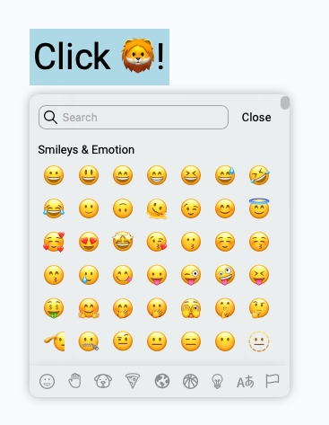

# React Emoji Selectors

Simple, ready to use, and customable react emoji selector component for every react project.

<p float="left">
   
    
</p>


## 👺 Demo 
Try and custom your emoji selector [here](https://61130061.github.io/react-emoji-selectors/).


## Content
- [Guideline](#-guideline)
   - [Install](#install-)
   - [Usage](#usage-)
- [EmojiSelector Props (Desktop version)](#-emojiselector-props-desktop-version)
   - [onClose](#onclose-default-none)
   - [output](#output-default-none)
   - [closeAfterSelect](#closeafterselect-default-true)
   - [clickOutsideToClose](#clickoutsidetoclose-default-true)
   - [highlihgt](#highlight-default-lightblue)
   - [darkMode](#darkmode-default-false)
   - [backgroundColor](#backgroundcolor-default-none)
   - [cornerRadius](#cornerradius-default-10px)
   - [recently](#recently-default-true)
   - [recentlyData](#recentlydata-default-null)
   - [clearRecently](#clearrecently-default-none)
- [MEmojiSelector Props (Mobile version)](#-memojiselector-props-mobile-version)
   - [onClose](#onclose-default-none-1)
   - [output](#output-default-none-1)
   - [closeAfterSelect](#closeafterselect-default-true-1)
   - [clickOutsideToClose](#clickoutsidetoclose-default-true-1)
   - [highlihgt](#highlight-default-lightblue-1)
   - [darkMode](#darkmode-default-false-1)
   - [recently](#recently-default-true-1)
   - [recentlyData](#recentlydata-default-null-1)
   - [clearRecently](#clearrecently-default-none-1)


## 📒 Guideline 

### Install 💾
```sh
yarn add react-emoji-selectors
```

### Usage 📠
To use `EmojiSelector`, we recommend you to wrap your triggle element and `EmojiSelector` under the same tag as an example below.
This is just a simple example of EmojiSelector.
You can customize it by using component props from [next section](#-emojiselector-props-desktop-version).

```js
import React, { useState } from 'react';
import { EmojiSelector } from 'react-emoji-selectors';

function App () {
   const [output, setOutput] = useState('🦁');
   const [showSelector, setShowSelector] = useState(true);

   return (
      <div className="App">
         <div>

            <div onClick={() => setShowSelector(true)}>
               Click {output}!
            </div>

            {showEmoji &&
               <EmojiSelector 
                  onClose={() => setShowSelector(false)} 
                  output={setOutput} 
               />
            }

         </div>
      </div>
   )
}
```

If you want responsive version for your responsive app, we recommend you to use mobile version `MEmojiSelector` for mobile and tablet screen size. 
Of course, you can use both in one application as well.
Here is the example of mobile version.

```js
{showEmoji &&
   <MEmojiSelector 
      onClose={() => setShowSelector(false)} 
      output={setOutput} 
   />
}
```


## 🐼 EmojiSelector Props (Desktop version)

### onClose (default: none)
Use this attribute as a function to set useState variable to close the emoji selector.
- input `function`
- return nothing

### output (default: none)
Use to get selected emoji from selector.
You can pass function through this attribute as an example below.
- input `function`
- return `string (emoji)`

### closeAfterSelect (default: true)
The emoji selector will close after user select an emoji when this attribute is true otherwise nothing happen.
- input `boolean`

### clickOutsideToClose (default: true)
If this attribute set to true, onClose function will be called when user clicks outside the emoji selector.
- input `boolean`

### highlight (default: 'lightblue')
Change color of highlight color of emoji selector.
- input `string (rgb or hex)`

### darkMode (default: false)
Change to true, if you want it darker.
- input `boolean`

### backgroundColor (default: none)
Change background color of emoji selector container.
- input `string (rgb or hex)`

### cornerRadius (default: '10px')
Change corner radius of the selector.
- input `string`

### recently (default: true)
To disable recently section at the top of selector, set this to false otherwise do nothing.
- input `boolean`

### recentlyData (default: null)
This props can be use only when `recently` props is true.
Use this props to pass your user recently emoji data.
By default, recently data will be collected in user's browser `localStorage` with the name of `react-emoji-selectos` (for this option no need to pass anything through this props).
Another option, if you would like to pass your own user data, you can pass array data of emoji through this props to show in recently section.
- input `Array` e.g. `['🦁', '🦙', '👺']`

### clearRecently (default: none)
This function will be called when user click at the clear button when you use your own data in recentlyData.
On the other hand, if you use `localStorage` (default setting) to collect recently data, you don't have to do anything.
This function will delete data from `localStorage` by default.
- input `function`


## 📱 MEmojiSelector Props (Mobile version)

### onClose (default: none)
Use this attribute as a function to set useState variable to close the emoji selector.
- input `function`
- return nothing

### output (default: none)
Use to get selected emoji from selector.
You can pass function through this attribute as an example below.
- input `function`
- return `string (emoji)`

### closeAfterSelect (default: true)
The emoji selector will close after user select an emoji when this attribute is true otherwise nothing happen.
- input `boolean`

### clickOutsideToClose (default: true)
If this attribute set to true, onClose function will be called when user clicks outside the emoji selector.
- input `boolean`

### highlight (default: 'lightblue')
Change color of highlight color of emoji selector.
- input `string (rgb or hex)`

### darkMode (default: false)
Change to true, if you want it darker.
- input `boolean`

### recently (default: true)
To disable recently section at the top of selector, set this to false otherwise do nothing.
- input `boolean`

### recentlyData (default: null)
This props can be use only when `recently` props is true.
Use this props to pass your user recently emoji data.
By default, recently data will be collected in user's browser `localStorage` with the name of `react-emoji-selectos` (for this option no need to pass anything through this props).
Another option, if you would like to pass your own user data, you can pass array data of emoji through this props to show in recently section.
- input `Array` e.g. `['🦁', '🦙', '👺']`

### clearRecently (default: none)
This function will be called when user click at the clear button when you use your own data in recentlyData.
On the other hand, if you use `localStorage` (default setting) to collect recently data, you don't have to do anything.
This function will delete data from `localStorage` by default.
- input `function`


## 📝 TodoList
- [ ] Fix mobile screen main when body too long
- [x] Demo page
- [ ] Emoji name badge when hover
- [x] Category tab
- [x] Close button
- [x] Recently group
- [x] Clear recently emoji
- [ ] Better search
- [x] Mobile version
- [x] Light/Dark mode
- [x] Selector position
- [x] README.md guideline
- [x] Recently section in mobile version
- [ ] Gitdoc with better guideline

## Contributing
I'm a newbiew developer so feel free to pull requiests or log issues.

